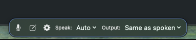
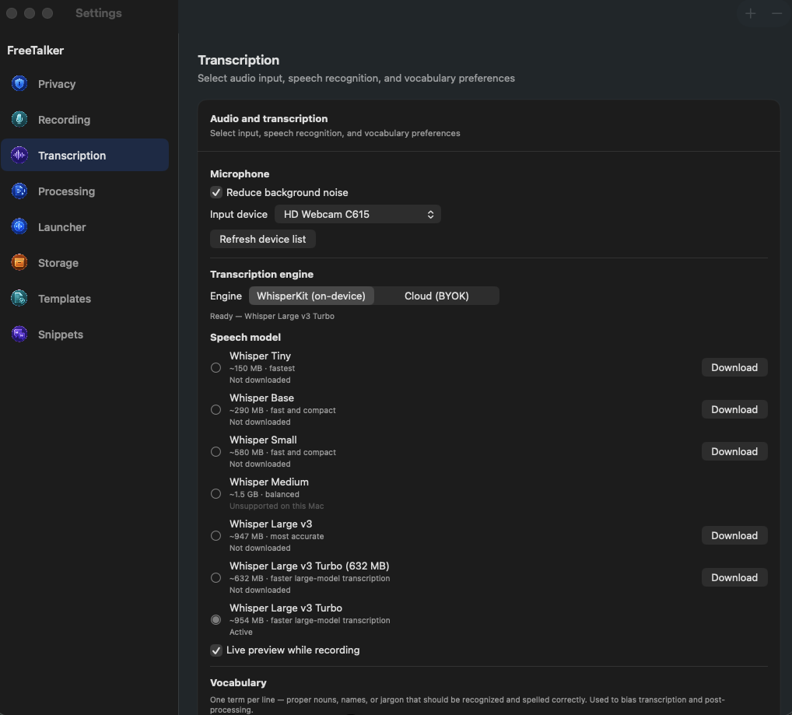
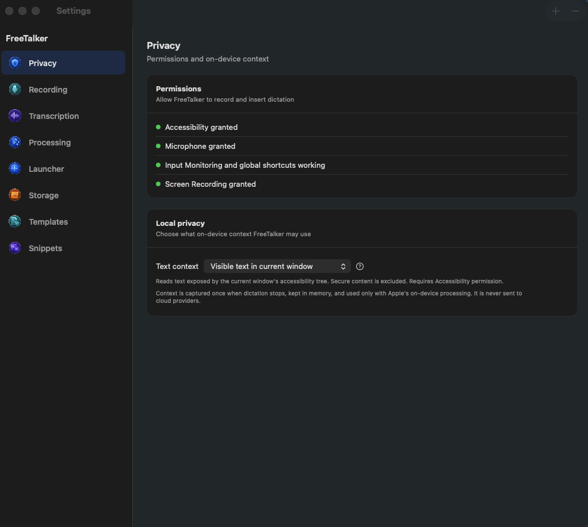
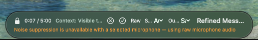
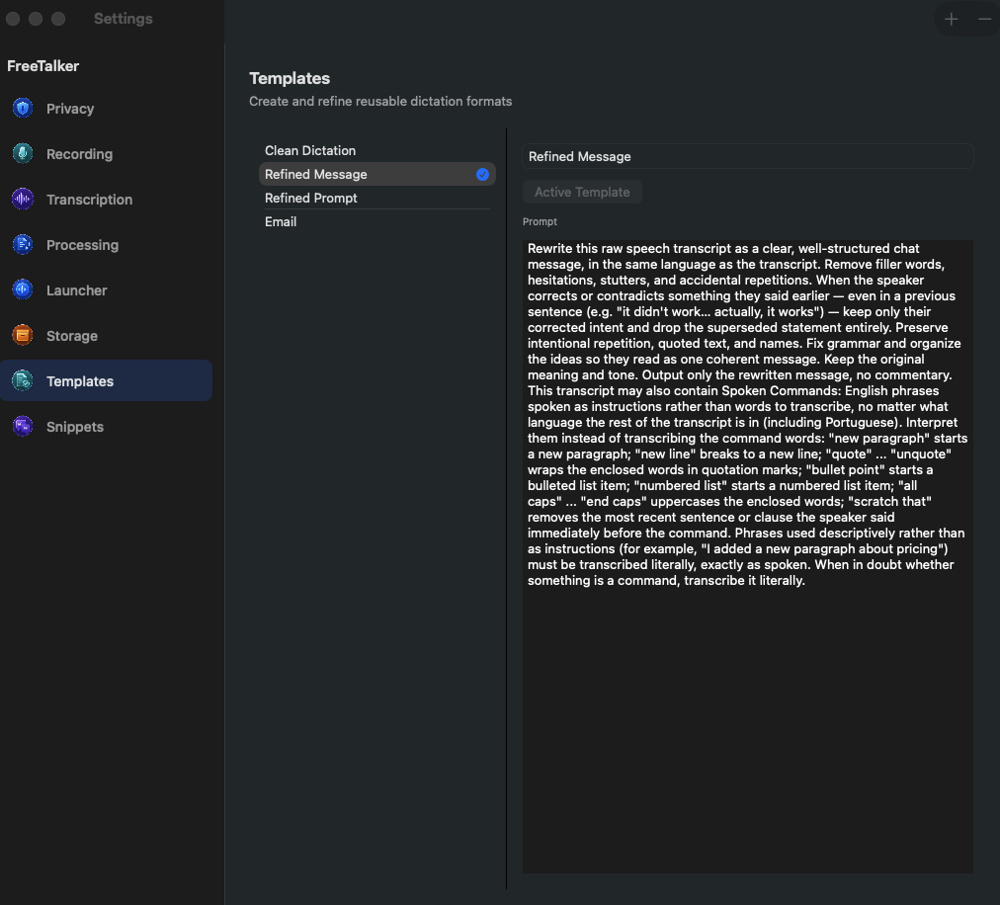
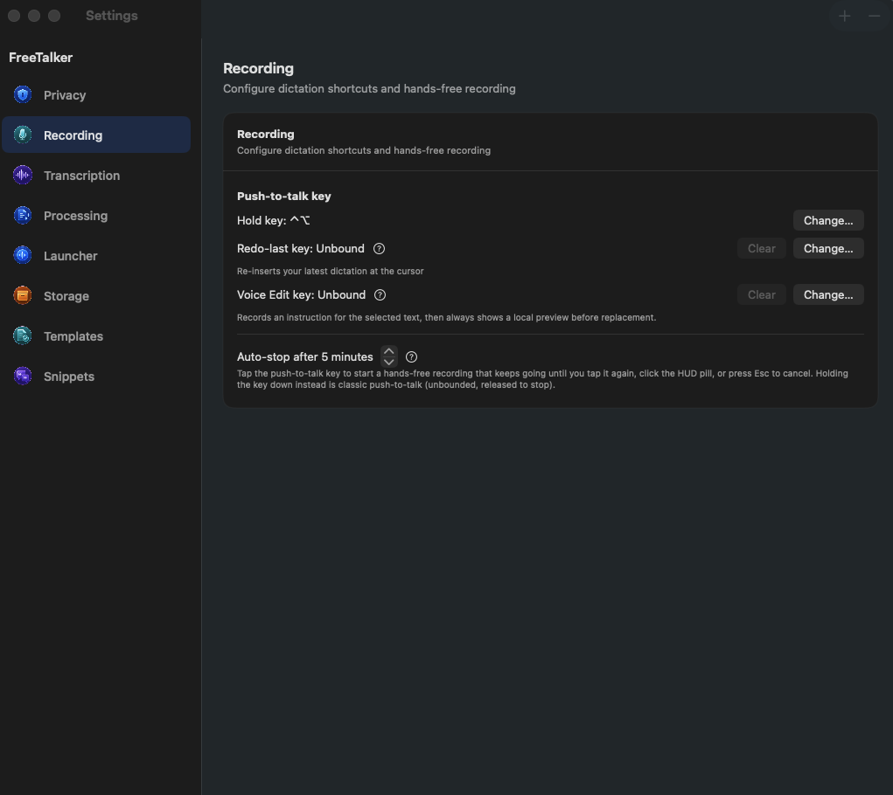

<p align="center"></p>

# FreeTalker

System-wide push-to-talk dictation for macOS. Hold a hotkey (default **Right-⌥**), speak,
release — the transcript is refined by the Active Template and inserted at your cursor. Tap
the same key instead of holding it for hands-free recording. Local Whisper transcription and
on-device Apple post-processing by default; cloud engines are optional and BYOK-only.

<p align="center">
  
</p>

## Requirements

- macOS 26, Apple Silicon.
- Xcode Command Line Tools (Swift 6.3+) are sufficient to build and run the app; the app is
  a Swift Package, not an `.xcodeproj`.
- Contributors running the test suite need full Xcode installed at
  `/Applications/Xcode.app` by default so Swift Testing is available.

## Build

```sh
make app     # swift build -c release, then assembles FreeTalker.app
open FreeTalker.app
```

Or in one step: `make run`.

The app build remains Command Line Tools-only and does not change the selected developer
directory. To run tests, use `make test`. The Makefile checks for full Xcode and Swift Testing,
prints the developer directory it uses, and scopes `DEVELOPER_DIR` to the test command without
mutating `xcode-select`. Override a non-default Xcode location explicitly:

```sh
make test XCODE_DEVELOPER_DIR=/path/to/Xcode.app/Contents/Developer
```

`make app` copies the release binary into `FreeTalker.app/Contents/MacOS/`, writes
`Contents/Info.plist` (from `Info.plist` at the repo root — `LSUIElement=true` so it's
menu-bar-only, plus the microphone usage string), and ad-hoc codesigns the bundle
(`codesign --force --deep -s -`).

First launch will download the WhisperKit `large-v3-turbo` model (~1 GB) — the menu bar
status line shows download progress.

### Stable signing identity (optional)

Ad-hoc signing (`-s -`) gives every build a different signature, so macOS treats each
rebuild as a new app and can drop TCC grants (Accessibility, Input Monitoring, Microphone)
that were previously approved — see "Permissions walkthrough" below. To make grants
survive rebuilds and self-updates:

```sh
scripts/make-signing-cert.sh   # once: creates a self-signed "FreeTalker Dev" cert
```

Then, in Keychain Access, trust the cert for code signing (the script prints the exact
steps — macOS requires this GUI confirmation, it can't be scripted). Build with:

```sh
make app CODESIGN_IDENTITY="FreeTalker Dev"
```

To have "Check for Updates…" rebuilds use the same identity, record it once at the repo
root: `echo "FreeTalker Dev" > .codesign-identity`.

## Speech models

Settings → Transcription offers seven multilingual Whisper models, from Tiny
and Base through Small, Medium, Large v3, and two Large v3 Turbo variants.
Smaller
models download faster, use less disk space, and usually transcribe faster.
Larger models favor accuracy, while the Turbo variants balance speed and
accuracy.

Download a model on demand, then select it to reload the transcription engine. You can
also delete downloaded models that aren't active. FreeTalker keeps the active model so a
cleanup can't remove the model currently serving dictation. WhisperKit shares model files
under `~/Documents/huggingface`.

<p align="center">
   Transcription showing the mic picker, noise reduction, WhisperKit vs Cloud engine toggle, model list, live preview, and vocabulary" width="700">
</p>

## Permissions walkthrough

On first launch, grant (System Settings → Privacy & Security):

1. **Microphone** — prompted automatically the first time you hold the push-to-talk key.
2. **Accessibility** — required for the global push-to-talk key listener and for pasting the
   refined text at your cursor. The menu bar shows a warning with an "Open System Settings"
   button if this isn't granted; find FreeTalker in Privacy & Security → Accessibility and
   enable it, then relaunch.
3. **Input Monitoring** — macOS will prompt for this automatically the first
   time the app creates its global key listener (a consequence of Accessibility
   + CGEventTap). Settings considers Input Monitoring available when the global
   shortcut listener is operational, because that confirms FreeTalker can
   receive the shortcuts it needs.

Settings (menu bar → "Settings…") shows live permission status.

Local builds use ad-hoc signing, so rebuilding the app can invalidate
permissions that macOS previously granted. Relaunch the current
`FreeTalker.app` first. If a permission still appears unavailable, remove
FreeTalker from the relevant Privacy & Security list, add the current app
bundle again, enable it, and relaunch.

<p align="center">
   Privacy showing granted permissions and the local-only text context picker" width="700">
</p>

## Settings

Settings uses a sidebar with eight focused sections:

- **Privacy** — permissions and on-device context.
- **Recording** — push-to-talk, hands-free recording, Insert Last Dictation,
  and Voice Edit.
- **Transcription** — microphone input, speech engines, models, live preview,
  noise reduction, and vocabulary.
- **Processing** — app rules, automatic template selection, output
  language, and cloud post-processing.
- **Launcher** — floating launcher visibility and placement.
- **Storage** — retention for recovery audio and imported media.
- **Templates** — create and edit post-processing templates.
- **Snippets** — reusable Voice Edit expansions and triggers.

Each section uses a generated transparent PNG icon. Settings that need more
context include a question-mark button that opens a short native explanation;
the same explanation is available as a hover tip.

## Running the app

<p align="center">
  
</p>

- Menu bar icon → pick the **Active Template** (Clean Dictation, Refined Message, Refined
  Prompt, Email — editable in Settings → Templates).
- Hold **Right-⌥**, speak (English or Portuguese, auto-detected), release. A small pill HUD
  shows "Recording…" then "Processing…". Turn on **Live preview while recording** in
  Settings → Transcription and the HUD streams the transcript as you speak,
  before refinement.
- **Reduce background noise** uses macOS voice processing with the
  system-default microphone. Choosing a specific input device uses verified raw
  capture instead; the HUD reports that noise suppression is unavailable. If
  voice-processed capture with the system default fails, FreeTalker retries once
  with raw microphone audio.
- Tap the key instead (under 0.4s) to start **hands-free recording**: it keeps going until you
  tap the key again, click the HUD pill, or press Esc to cancel. Holding the key down is still
  classic push-to-talk. An auto-stop cap (default 5 minutes, configurable 1–60
  in Settings → Recording) guards against a stuck key.
- The refined text is pasted at your cursor. If pasting isn't possible, it's left on the
  pasteboard and the HUD says "Copied — paste manually".
- **Library…** opens the searchable history of past Dictations, with "Re-process with…" to
  re-run a stored transcript through a different Template. Each entry can be deleted
  individually, or wiped entirely with **Delete All** — which also purges any saved debug audio
  (`last-dictation.wav`, failed-transcription recordings) alongside the database rows. Choosing
  **Translate…** sends the chosen Library text only to the configured Cloud post-processing
  endpoint.
- **Library → Recoveries** keeps failed dictation audio locally on this Mac so
  you can listen, retry with optional language/model/template overrides, or
  permanently delete it. Recovery audio is never uploaded by the recovery
  library itself. Settings → Storage controls automatic deletion after 1, 7
  (default), 30, or 90 days, or keeps it until you delete it.
- **Library → Imports** accepts WAV, M4A, MP3, MP4, and MOV from the file picker or drag and drop. FreeTalker extracts video audio, transcribes it with the selected local Whisper model, separates speakers locally, and lets you rename speakers and export TXT, Markdown, SRT, or VTT. Imports default to 7-day retention (configurable in Settings). The source file is never modified or deleted, and imported media, derived audio, transcripts, and speaker data never leave your Mac.
  The media integration suite generates a tiny MOV containing both video and audio, then verifies the production probe and decoder extract normalized 16 kHz mono frames without changing the MOV.
- An optional **Insert Last Dictation key** (Settings → Recording, unbound by
  default) re-inserts the newest Library entry at your cursor without
  re-recording or re-processing — handy when a paste got dismissed or
  overwritten.

## Floating controls and scratchpad

The edge launcher is off by default. In Settings → Launcher, turn on **Show
edge launcher**, choose its screen edge, and select **Auto**, **English**, or
**Portuguese** as the default dictation language. Hover over the launcher to
reveal dictation, Scratchpad, Settings, and language controls.

Drag the collapsed launcher, recording HUD, or temporary status HUD anywhere
within the usable area. FreeTalker remembers each surface independently for
each display. A visible Dock and menu bar remain unobstructed. When the Dock is
auto-hidden, or another app is full-screen on that display, you can move the
surface to the physical bottom edge. Moving between Spaces or displays
reclamps each surface without making it an active window.

Set **Default output language** in Settings → Processing to **Same as spoken**
(the default), English, Portuguese, Mandarin Chinese, Hindi, Spanish,
Standard Arabic, French, or German. The edge launcher and recording HUD can
override that choice for one recording without changing the default. Named
output languages are API-only: FreeTalker sends the live transcript to the
configured Cloud post-processing endpoint. A requested translation never
falls back to Apple's on-device model, another provider, or automatic
source-text insertion.

Open **Scratchpad…** from the menu bar or the edge launcher. Type directly, or
place the insertion point or select text and choose **Dictate**; live speech
appears as a preview before the final transcript is inserted. Use the toolbar
for body and heading styles, bold, italic, bulleted and numbered lists, or
clearing supported formatting. Scratchpad text and formatting are saved
automatically on this Mac.

Scratchpad AI actions require a configured API-backed Cloud post-processing
provider under Settings → Processing. **Improve writing**, **Expand**,
**Condense**, and **Custom instruction** send the selected text to that
configured cloud endpoint, or send the entire Scratchpad when nothing is
selected. These actions don't fall back to Apple's on-device model. If the
source changes while a request is running, FreeTalker leaves it untouched
instead of replacing newer edits.

## Templates

Four built-ins ship with the app: **Clean Dictation** (default), **Refined Message**,
**Refined Prompt**, and **Email**. Every Template strips disfluencies ("um", "uh", "hmm") and
collapses self-corrections — "I'll do A… actually, I'll do B" becomes "I'll do B" — even when
the correction spans multiple sentences.

A built-in Template you've never edited quietly picks up improved prompts as the app evolves;
once you edit one yourself, it's yours and is never touched automatically.

<p align="center">
   Templates showing the template list and the Refined Message prompt editor" width="700">
</p>

### Spoken Commands

Every built-in Template also interprets a set of English instruction phrases spoken mid-dictation,
regardless of what language the rest of the dictation is in — say "scratch that" partway through a
Portuguese dictation and it's still interpreted as a command, not transcribed. Supported phrases:
"new paragraph", "new line", "quote" … "unquote", "bullet point", "numbered list", "all caps" …
"end caps", and "scratch that" (removes the sentence or clause you said immediately before it). A
phrase used descriptively rather than as an instruction — "I added a new paragraph about
pricing" — is still transcribed literally; when in doubt, the model transcribes rather than acts.

### Context awareness

Settings → Processing → **App Rules** maps an app (by bundle ID)
to a Template and/or a forced Transcript language, so dictating in Slack can
default to Refined Message while Mail defaults to Email. A rule can set either
half alone or both together. The Active Template is still used when no rule's
Template half matches; see "Language" below for how the language half fits
with the pin and the Recording Panel. The frontmost app's identity is also
passed to the post-processor as context, so refined output can account for
where it's headed.

Settings → Privacy → **Local context** can optionally capture selected text,
the focused field, the active window's accessibility text, or a one-time
active-window screenshot read by Apple Vision OCR. The scope defaults to Off
and is captured exactly once when dictation stops. Manual App Rules always
take precedence over the optional automatic local style.

Selected text, Focused field, and Active window require Accessibility permission. Window + local
OCR requires Screen Recording permission only; Accessibility can improve its window metadata but
is not required for capture or OCR. If the exact stopped window is no longer available, FreeTalker
continues without OCR instead of capturing another window.

macOS exposes Screen Recording preflight as granted or not granted. Settings
reflects that current state directly and offers explicit **Request Access** and
**Open System Settings** actions when it is not granted. After you grant access,
macOS may require FreeTalker to relaunch before preflight reports it as
available. If it remains unavailable, remove and re-add the current app bundle
in Privacy & Security, then relaunch it.

**Local-only privacy boundary:** accessibility text, screenshots, and OCR output stay in memory
and are supplied only to Apple's on-device Foundation Model. Screenshot bytes are released
immediately after local OCR. Local context is never persisted, logged, or included in cloud/BYOK
post-processing requests; when cloud post-processing is configured, FreeTalker omits it entirely.

### Voice Edit and snippets

<p align="center">
   Recording showing the push-to-talk hold key, Insert Last Dictation key, Voice Edit key, and hands-free auto-stop cap" width="700">
</p>

Assign a **Voice Edit key** in Settings → Recording, select editable text, and
press the key. Speak the instruction, then press the key again. Voice Edit
transcribes the instruction with the local WhisperKit engine, resolves any
exact snippet trigger from the on-device snippet database, and uses Apple's
on-device Foundation Model when generation is needed. It always shows a
preview of the original and proposed text; nothing is replaced until you
explicitly confirm. If the app, field, selection, or selected text changed,
replacement is refused and Copy remains available.

Create, edit, rename, or delete reusable snippets under Settings → Snippets. Put one trigger phrase
per line. Matching ignores case, surrounding punctuation, and repeated whitespace, while duplicate
normalized triggers are rejected. Ambiguous snippets migrated from older versions require an
explicit choice in the preview and can be resolved by editing their trigger phrases in Settings.
Snippet renames update the persisted record used by future matches.

Voice Edit selected text, spoken instructions, and previews stay in memory and
are never sent to a cloud service, saved to Library, or logged. Snippet names,
triggers, and expansions are stored only in FreeTalker's local SQLite database.

### Custom vocabulary

Settings → Transcription → **Vocabulary** takes a list of names, jargon,
or acronyms your dictation tends to get wrong. Terms bias WhisperKit's decoding
toward the right spelling and are also enforced as corrections during
post-processing, so they hold even if the transcript missed them.

## Language

The menu bar has an **Auto / English / Portuguese** pin below the Template list,
forcing the transcript language instead of auto-detecting it. Settings →
Processing → **App Rules** can override the pin per app, alongside
its Template rule. The Recording Panel's EN/PT buttons (below) add a one-shot
override on top of both, good for a single dictation without changing any
standing setting. Precedence, most to least specific: **one-shot > app rule >
pin > auto**.

## Recording Panel

While recording (both push-to-talk hold and hands-free), the HUD shows a row of controls instead
of a plain pill:

- **Cancel** (✕) discards the recording.
- **Done** (✓) stops and runs it through the Active Template, same as releasing the key.
- **Raw** stops and pastes the transcript verbatim, skipping post-processing entirely; the
  Library entry is filed under the reserved Template name "Raw Transcript" rather than whatever
  Template was active.
- **EN** / **PT** set a one-shot language override for this recording only (tap the active one
  again to clear it) — see "Language" above for how it fits with the pin and App Rules.
- The Template name button cycles the Active Template without leaving the recording.
- **Lock** (only shown while not already locked) switches a held push-to-talk key into
  hands-free recording without releasing it — the elapsed/cap readout replaces the Lock button
  once locked.

## Cloud engines (BYOK)

Both the transcription and post-processing stages default to on-device models and can
optionally be pointed at a cloud provider — bring your own API key, nothing is bundled. Keys
live in the macOS Keychain only; they're never written to disk unencrypted, bundled with the
app, or logged.

- **Cloud STT** — Settings → Transcription → **Transcription engine**
  toggles between WhisperKit (on-device, default) and Cloud.
- **Cloud post-processing** — Settings → Processing → **Cloud
  post-processing** accepts a provider, base URL, and model. Supported
  providers are OpenAI-compatible endpoints
  (including [Ollama cloud](https://ollama.com/v1)) and Anthropic. Once a provider has a key,
  endpoint, and model all set, cloud post-processing runs automatically for every Dictation —
  it isn't chosen per Template. A key is optional only for an OpenAI-compatible loopback HTTP
  endpoint (`localhost`, `127.0.0.1`, or `::1`); other endpoints and providers still require
  one. For ordinary template formatting that doesn't request translation,
  leaving a required field unset can fall back to the on-device Apple model.
  Named output translation, Scratchpad AI actions, and Library translation are
  API-only and never use that fallback.

Both sections have a **Test connection** button, enabled once the required fields are filled
in. It sends a single request and reports a fixed status hint — "Connected ✓", an HTTP failure
like "Failed — HTTP 401 (check API key)", or "Failed — cannot reach host" — never the raw
response body or the key itself.

For fully local LLM post-processing, run Ollama Desktop and use the existing
OpenAI-compatible BYOK provider with `http://localhost:11434/v1`. Ollama's local endpoint
doesn't require an API key; FreeTalker omits the Authorization header when the key is empty.

## Manual end-to-end checklist

1. `make run`. Confirm the menu bar waveform icon appears (no Dock icon — it's
   `LSUIElement`).
2. Open Settings → Privacy. Grant Accessibility if prompted; confirm the dot
   turns green.
3. Click into TextEdit (or any text field). Hold Right-⌥, say a short English sentence,
   release. Confirm: HUD pill appears then disappears, and the refined text is pasted at the
   cursor within a few seconds (first run: WhisperKit downloads the model first — watch the
   menu bar status line).
4. Repeat step 3 speaking Portuguese (pt-BR). Confirm the Library entry shows `language: pt`
   and the refined text reads naturally in Portuguese.
5. Open Library…. Confirm both Dictations appear, reverse-chronological, with transcript +
   refined output. Search for a distinctive word from step 3; confirm it's found.
6. Pick a Library entry → "Re-process with…" → a different Template. Confirm a new entry is
   appended and the newly refined text is pasted at the cursor.
7. Settings → Templates: edit a prompt, confirm it persists (re-open Settings). Add a new
   Template, make it Active from the menu bar, dictate, confirm it's used.
8. Settings → Recording → "Change…" next to the push-to-talk key, press a
   different modifier (for example, Left-⌃), confirm the label updates, and
   confirm that key now triggers recording instead of Right-⌥.
9. (Optional, BYOK) Set a Cloud STT key under Settings → Transcription, or
   fill in Cloud post-processing under Settings → Processing. Dictate and
   confirm the cloud path is used and the Library row's `engine` reflects it.
   Then unplug the network or clear the key and confirm post-processing failure
   falls back to the raw transcript being pasted without dropping the
   dictation.
