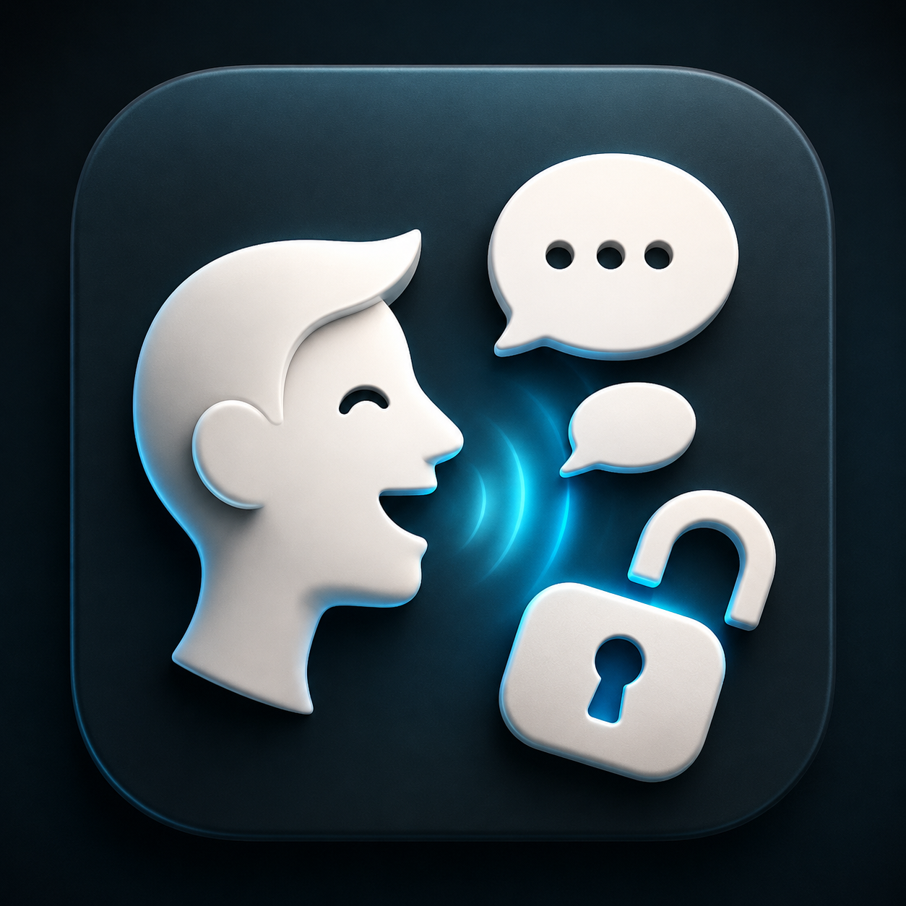
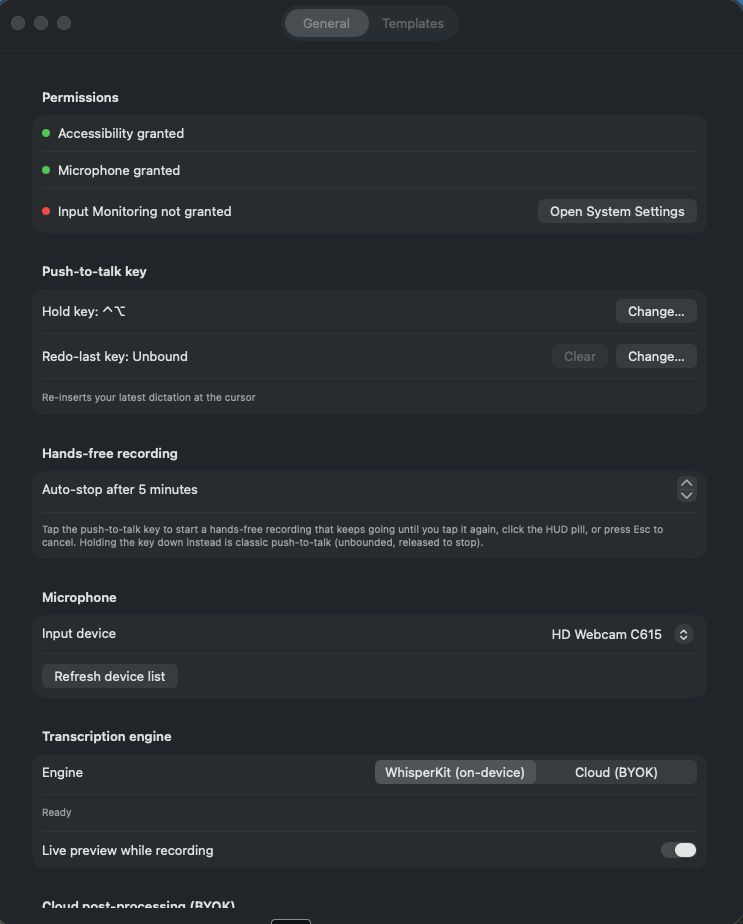
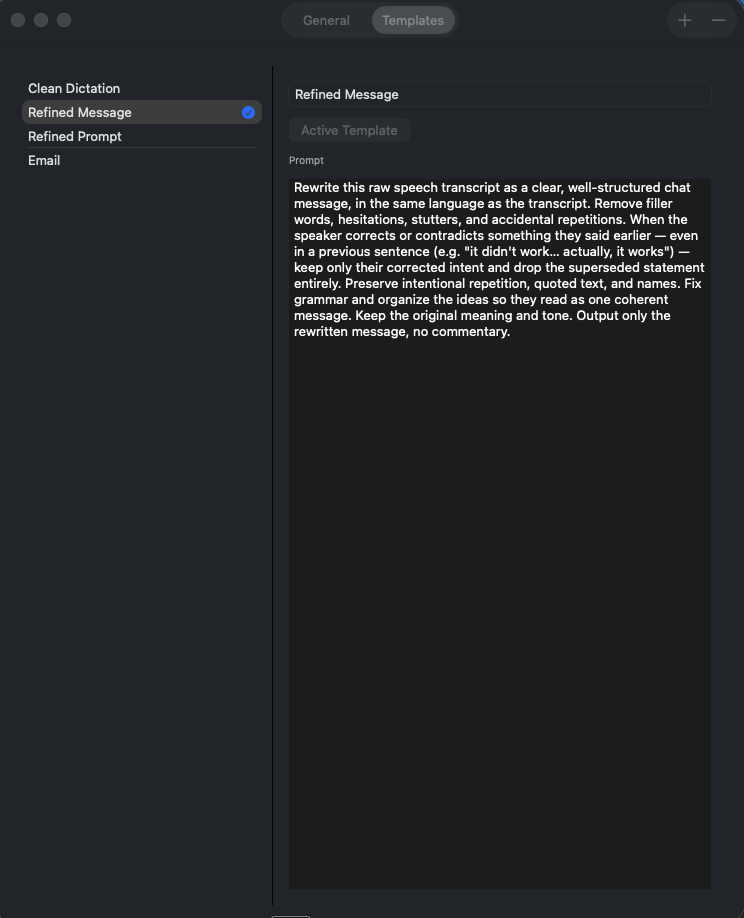
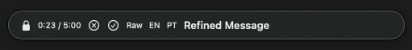

<p align="center"></p>

# FreeTalker

System-wide push-to-talk dictation for macOS. Hold a hotkey (default **Right-⌥**), speak,
release — the transcript is refined by the Active Template and inserted at your cursor. Tap
the same key instead of holding it for hands-free recording. Local Whisper transcription and
on-device Apple post-processing by default; cloud engines are optional and BYOK-only.

## Requirements

- macOS 26, Apple Silicon.
- Xcode Command Line Tools (Swift 6.3+). **No Xcode.app is required or used** — this is a
  Swift Package, not an `.xcodeproj`.

## Build

```sh
make app     # swift build -c release, then assembles FreeTalker.app
open FreeTalker.app
```

Or in one step: `make run`.

`make app` copies the release binary into `FreeTalker.app/Contents/MacOS/`, writes
`Contents/Info.plist` (from `Info.plist` at the repo root — `LSUIElement=true` so it's
menu-bar-only, plus the microphone usage string), and ad-hoc codesigns the bundle
(`codesign --force --deep -s -`).

First launch will download the WhisperKit `large-v3-turbo` model (~1 GB) — the menu bar
status line shows download progress.

## Speech models

Settings offers seven multilingual Whisper models, from Tiny and Base through Small,
Medium, Large v3, and two Large v3 Turbo variants. Smaller models download faster, use
less disk space, and usually transcribe faster. Larger models favor accuracy, while the
Turbo variants balance speed and accuracy.

Download a model on demand, then select it to reload the transcription engine. You can
also delete downloaded models that aren't active. FreeTalker keeps the active model so a
cleanup can't remove the model currently serving dictation. WhisperKit shares model files
under `~/Documents/huggingface`.

## Permissions walkthrough

On first launch, grant (System Settings → Privacy & Security):

1. **Microphone** — prompted automatically the first time you hold the push-to-talk key.
2. **Accessibility** — required for the global push-to-talk key listener and for pasting the
   refined text at your cursor. The menu bar shows a warning with an "Open System Settings"
   button if this isn't granted; find FreeTalker in Privacy & Security → Accessibility and
   enable it, then relaunch.
3. **Input Monitoring** — macOS will prompt for this automatically the first time the app
   creates its global key listener (a consequence of Accessibility + CGEventTap).

Settings (menu bar → "Settings…") shows live permission status.

## Running the app

- Menu bar icon → pick the **Active Template** (Clean Dictation, Refined Message, Refined
  Prompt, Email — editable in Settings → Templates).
- Hold **Right-⌥**, speak (English or Portuguese, auto-detected), release. A small pill HUD
  shows "Recording…" then "Processing…". Turn on **Live preview while recording** in
  Settings → General and the HUD streams the transcript as you speak, before refinement.
- Tap the key instead (under 0.4s) to start **hands-free recording**: it keeps going until you
  tap the key again, click the HUD pill, or press Esc to cancel. Holding the key down is still
  classic push-to-talk. An auto-stop cap (default 5 minutes, configurable 1–60 in Settings →
  General) guards against a stuck key.
- The refined text is pasted at your cursor. If pasting isn't possible, it's left on the
  pasteboard and the HUD says "Copied — paste manually".
- **Library…** opens the searchable history of past Dictations, with "Re-process with…" to
  re-run a stored transcript through a different Template. Each entry can be deleted
  individually, or wiped entirely with **Delete All** — which also purges any saved debug audio
  (`last-dictation.wav`, failed-transcription recordings) alongside the database rows.
- An optional **Redo-last key** (Settings → General, unbound by default) re-inserts the newest
  Library entry at your cursor without re-recording — handy when a paste got dismissed or
  overwritten.

## Templates

Four built-ins ship with the app: **Clean Dictation** (default), **Refined Message**,
**Refined Prompt**, and **Email**. Every Template strips disfluencies ("um", "uh", "hmm") and
collapses self-corrections — "I'll do A… actually, I'll do B" becomes "I'll do B" — even when
the correction spans multiple sentences.

A built-in Template you've never edited quietly picks up improved prompts as the app evolves;
once you edit one yourself, it's yours and is never touched automatically.

### Spoken Commands

Every built-in Template also interprets a set of English instruction phrases spoken mid-dictation,
regardless of what language the rest of the dictation is in — say "scratch that" partway through a
Portuguese dictation and it's still interpreted as a command, not transcribed. Supported phrases:
"new paragraph", "new line", "quote" … "unquote", "bullet point", "numbered list", "all caps" …
"end caps", and "scratch that" (removes the sentence or clause you said immediately before it). A
phrase used descriptively rather than as an instruction — "I added a new paragraph about
pricing" — is still transcribed literally; when in doubt, the model transcribes rather than acts.

### Context awareness

Settings → Templates → **App Rules** maps an app (by bundle ID) to a Template and/or a forced
Transcript language, so dictating in Slack can default to Refined Message while Mail defaults to
Email — a rule can set either half alone or both together. The Active Template is still used
when no rule's Template half matches; see "Language" below for how the language half fits with
the pin and the Recording Panel. The frontmost app's identity is also passed to the
post-processor as context, so refined output can account for where it's headed.

### Custom vocabulary

Settings → Templates → **Vocabulary** takes a list of names, jargon, or acronyms your dictation
tends to get wrong. Terms bias WhisperKit's decoding toward the right spelling and are also
enforced as corrections during post-processing, so they hold even if the transcript missed them.

## Language

The menu bar has an **Auto / English / Portuguese** pin below the Template list, forcing the
transcript language instead of auto-detecting it. Settings → Templates → **App Rules** can
override the pin per app, alongside its Template rule. The Recording Panel's EN/PT buttons
(below) add a one-shot override on top of both, good for a single dictation without changing
any standing setting. Precedence, most to least specific: **one-shot > app rule > pin > auto**.

## Recording Panel

While recording (both push-to-talk hold and hands-free), the HUD shows a row of controls instead
of a plain pill:

- **Cancel** (✕) discards the recording.
- **Done** (✓) stops and runs it through the Active Template, same as releasing the key.
- **Raw** stops and pastes the transcript verbatim, skipping post-processing entirely; the
  Library entry is filed under the reserved Template name "Raw Transcript" rather than whatever
  Template was active.
- **EN** / **PT** set a one-shot language override for this recording only (tap the active one
  again to clear it) — see "Language" above for how it fits with the pin and App Rules.
- The Template name button cycles the Active Template without leaving the recording.
- **Lock** (only shown while not already locked) switches a held push-to-talk key into
  hands-free recording without releasing it — the elapsed/cap readout replaces the Lock button
  once locked.

## Cloud engines (BYOK)

Both the transcription and post-processing stages default to on-device models and can
optionally be pointed at a cloud provider — bring your own API key, nothing is bundled. Keys
live in the macOS Keychain only; they're never written to disk unencrypted, bundled with the
app, or logged.

- **Cloud STT** — Settings → General → **Transcription engine** toggles between WhisperKit
  (on-device, default) and Cloud.
- **Cloud post-processing** — Settings → General → **Cloud post-processing** accepts a
  provider, base URL, and model. Supported providers are OpenAI-compatible endpoints
  (including [Ollama cloud](https://ollama.com/v1)) and Anthropic. Once a provider has a key,
  endpoint, and model all set, cloud post-processing runs automatically for every Dictation —
  it isn't chosen per Template. A key is optional only for an OpenAI-compatible loopback HTTP
  endpoint (`localhost`, `127.0.0.1`, or `::1`); other endpoints and providers still require
  one. Leave any required field unset and FreeTalker falls back to the on-device Apple model.

Both sections have a **Test connection** button, enabled once the required fields are filled
in. It sends a single request and reports a fixed status hint — "Connected ✓", an HTTP failure
like "Failed — HTTP 401 (check API key)", or "Failed — cannot reach host" — never the raw
response body or the key itself.

For fully local LLM post-processing, run Ollama Desktop and use the existing
OpenAI-compatible BYOK provider with `http://localhost:11434/v1`. Ollama's local endpoint
doesn't require an API key; FreeTalker omits the Authorization header when the key is empty.


*Settings → General: configure permissions, recording controls, microphone input, and the
transcription engine.*


*Settings → Templates: choose a template and edit its post-processing prompt.*


*Recording panel: monitor elapsed time and control raw mode, language, and the active
template without leaving your current app.*

## Manual end-to-end checklist

1. `make run`. Confirm the menu bar waveform icon appears (no Dock icon — it's
   `LSUIElement`).
2. Open Settings → General. Grant Accessibility if prompted; confirm the dot turns green.
3. Click into TextEdit (or any text field). Hold Right-⌥, say a short English sentence,
   release. Confirm: HUD pill appears then disappears, and the refined text is pasted at the
   cursor within a few seconds (first run: WhisperKit downloads the model first — watch the
   menu bar status line).
4. Repeat step 3 speaking Portuguese (pt-BR). Confirm the Library entry shows `language: pt`
   and the refined text reads naturally in Portuguese.
5. Open Library…. Confirm both Dictations appear, reverse-chronological, with transcript +
   refined output. Search for a distinctive word from step 3; confirm it's found.
6. Pick a Library entry → "Re-process with…" → a different Template. Confirm a new entry is
   appended and the newly refined text is pasted at the cursor.
7. Settings → Templates: edit a prompt, confirm it persists (re-open Settings). Add a new
   Template, make it Active from the menu bar, dictate, confirm it's used.
8. Settings → General → "Change…" next to the push-to-talk key, press a different modifier
   (e.g. Left-⌃), confirm the label updates and that key now triggers recording instead of
   Right-⌥.
9. (Optional, BYOK) Settings → General → set a Cloud STT key, or fill in Cloud post-processing
   (provider, base URL, model, key); dictate and confirm the cloud path is used and the
   Library row's `engine` reflects it. Then unplug network / clear the key and confirm
   post-processing failure falls back to the raw transcript being pasted (never silently
   drops the dictation).
