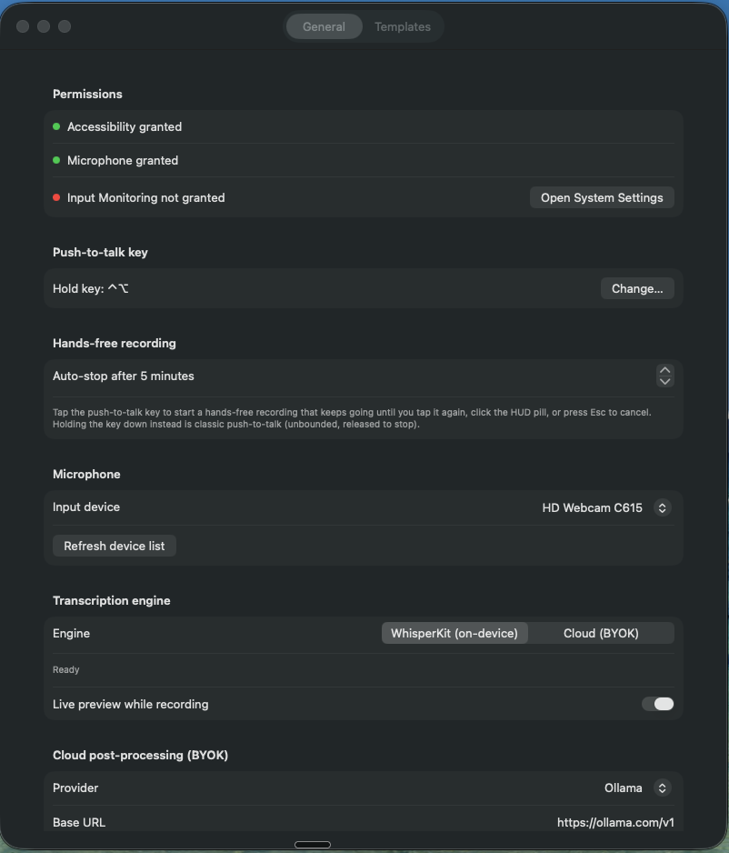

<p align="center"></p>

# FreeTalker

System-wide push-to-talk dictation for macOS. Hold a hotkey (default **Right-⌥**), speak,
release — the transcript is refined by the Active Template and inserted at your cursor. Tap
the same key instead of holding it for hands-free recording. Local Whisper transcription and
on-device Apple post-processing by default; cloud engines are optional and BYOK-only. See
`PLAN.md` for the full spec and `CONTEXT.md` for terminology.

## Requirements

- macOS 26, Apple Silicon.
- Xcode Command Line Tools (Swift 6.3+). **No Xcode.app is required or used** — this is a
  Swift Package, not an `.xcodeproj`.

## Build

```sh
make app     # swift build -c release, then assembles FreeTalker.app
open FreeTalker.app
```

Or in one step: `make run`.

`make app` copies the release binary into `FreeTalker.app/Contents/MacOS/`, writes
`Contents/Info.plist` (from `Info.plist` at the repo root — `LSUIElement=true` so it's
menu-bar-only, plus the microphone usage string), and ad-hoc codesigns the bundle
(`codesign --force --deep -s -`).

First launch will download the WhisperKit `large-v3-turbo` model (~1 GB) — the menu bar
status line shows download progress.

## Permissions walkthrough

On first launch, grant (System Settings → Privacy & Security):

1. **Microphone** — prompted automatically the first time you hold the push-to-talk key.
2. **Accessibility** — required for the global push-to-talk key listener and for pasting the
   refined text at your cursor. The menu bar shows a warning with an "Open System Settings"
   button if this isn't granted; find FreeTalker in Privacy & Security → Accessibility and
   enable it, then relaunch.
3. **Input Monitoring** — macOS will prompt for this automatically the first time the app
   creates its global key listener (a consequence of Accessibility + CGEventTap).

Settings (menu bar → "Settings…") shows live permission status.

## Running the app

- Menu bar icon → pick the **Active Template** (Clean Dictation, Refined Message, Refined
  Prompt, Email — editable in Settings → Templates).
- Hold **Right-⌥**, speak (English or Portuguese, auto-detected), release. A small pill HUD
  shows "Recording…" then "Processing…". Turn on **Live preview while recording** in
  Settings → General and the HUD streams the transcript as you speak, before refinement.
- Tap the key instead (under 0.4s) to start **hands-free recording**: it keeps going until you
  tap the key again, click the HUD pill, or press Esc to cancel. Holding the key down is still
  classic push-to-talk. An auto-stop cap (default 5 minutes, configurable 1–60 in Settings →
  General) guards against a stuck key.
- The refined text is pasted at your cursor. If pasting isn't possible, it's left on the
  pasteboard and the HUD says "Copied — paste manually".
- **Library…** opens the searchable history of past Dictations, with "Re-process with…" to
  re-run a stored transcript through a different Template.

## Templates

Four built-ins ship with the app: **Clean Dictation** (default), **Refined Message**,
**Refined Prompt**, and **Email**. Every Template strips disfluencies ("um", "uh", "hmm") and
collapses self-corrections — "I'll do A… actually, I'll do B" becomes "I'll do B" — even when
the correction spans multiple sentences.

A built-in Template you've never edited quietly picks up improved prompts as the app evolves;
once you edit one yourself, it's yours and is never touched automatically.

### Context awareness

Settings → Templates → **App Rules** maps an app (by bundle ID) to a Template, so dictating in
Slack can default to Refined Message while Mail defaults to Email. The Active Template is still
used when no rule matches. The frontmost app's identity is also passed to the post-processor as
context, so refined output can account for where it's headed.

### Custom vocabulary

Settings → Templates → **Vocabulary** takes a list of names, jargon, or acronyms your dictation
tends to get wrong. Terms bias WhisperKit's decoding toward the right spelling and are also
enforced as corrections during post-processing, so they hold even if the transcript missed them.

## Cloud engines (BYOK)

Both the transcription and post-processing stages default to on-device models and can
optionally be pointed at a cloud provider — bring your own API key, nothing is bundled. Keys
live in the macOS Keychain only; they're never written to disk unencrypted, bundled with the
app, or logged.

- **Cloud STT** — Settings → General → **Transcription engine** toggles between WhisperKit
  (on-device, default) and Cloud.
- **Cloud post-processing** — Settings → General → **Cloud post-processing** accepts a
  provider, base URL, and model. Supported providers are OpenAI-compatible endpoints
  (including [Ollama cloud](https://ollama.com/v1)) and Anthropic. Once a provider has a key,
  endpoint, and model all set, cloud post-processing runs automatically for every Dictation —
  it isn't chosen per Template. Leave any of the three unset and FreeTalker falls back to the
  on-device Apple model.


*Settings → General: permissions status, hotkey, hands-free auto-stop, microphone, engine
selection, and cloud post-processing.*

## Running tests

```sh
make selfcheck
```

This runs the same two checks the spec calls for — FTS search round-trip and template
seeding — via `SelfCheck.swift`, invoked as `FreeTalker --self-check` (no test framework).

**Why not plain `swift test`:** `Tests/FreeTalkerTests/FreeTalkerTests.swift` is a real
swift-testing test target and compiles cleanly (`make test` proves this — it runs
`swift build --build-tests`). But *running* it fails in this Command Line Tools-only
environment: `swift test` needs `Testing.framework`'s runtime, whose supporting dylibs
(e.g. `lib_TestingInterop.dylib`) are only shipped inside Xcode.app, not with the standalone
CLT SDK. This is an environment limitation, not a code issue — installing Xcode would make
`swift test` work with the exact same test file. `make selfcheck` is the guaranteed-runnable
substitute for today's environment.

## Manual end-to-end checklist

1. `make run`. Confirm the menu bar waveform icon appears (no Dock icon — it's
   `LSUIElement`).
2. Open Settings → General. Grant Accessibility if prompted; confirm the dot turns green.
3. Click into TextEdit (or any text field). Hold Right-⌥, say a short English sentence,
   release. Confirm: HUD pill appears then disappears, and the refined text is pasted at the
   cursor within a few seconds (first run: WhisperKit downloads the model first — watch the
   menu bar status line).
4. Repeat step 3 speaking Portuguese (pt-BR). Confirm the Library entry shows `language: pt`
   and the refined text reads naturally in Portuguese.
5. Open Library…. Confirm both Dictations appear, reverse-chronological, with transcript +
   refined output. Search for a distinctive word from step 3; confirm it's found.
6. Pick a Library entry → "Re-process with…" → a different Template. Confirm a new entry is
   appended and the newly refined text is pasted at the cursor.
7. Settings → Templates: edit a prompt, confirm it persists (re-open Settings). Add a new
   Template, make it Active from the menu bar, dictate, confirm it's used.
8. Settings → General → "Change…" next to the push-to-talk key, press a different modifier
   (e.g. Left-⌃), confirm the label updates and that key now triggers recording instead of
   Right-⌥.
9. (Optional, BYOK) Settings → General → set a Cloud STT key, or fill in Cloud post-processing
   (provider, base URL, model, key); dictate and confirm the cloud path is used and the
   Library row's `engine` reflects it. Then unplug network / clear the key and confirm
   post-processing failure falls back to the raw transcript being pasted (never silently
   drops the dictation).

## Known deviations / ponytail shortcuts

- **Push-to-talk hotkey is modifier-keys only** (⌥/⌃/⌘/⇧, left or right), identified via the
  device-dependent `NX_DEVICE*KEYMASK` bits on `flagsChanged` events. A non-modifier key (e.g.
  F13) would need a second `keyDown`/`keyUp` CGEventTap — not needed for the spec'd default
  (Right-⌥) or realistic alternatives. See `HotKeyManager.swift`.
- **Templates are a JSON file**, not a SQLite table — PLAN.md explicitly allows either,
  JSON is simpler for a handful of CRUD records. See `TemplateStore.swift`.
- **`swift test` cannot run** in this CLT-only environment (see "Running tests" above);
  `make selfcheck` is the working substitute. The test target still compiles and documents
  intent for a full-Xcode environment.
- **WhisperKit model variant** is pinned to the exact HF repo folder name
  `large-v3_turbo_954MB` rather than a glob, to avoid ambiguous matches against sibling
  distil/dated turbo variants in `argmaxinc/whisperkit-coreml`. See `WhisperKitEngine.swift`.
