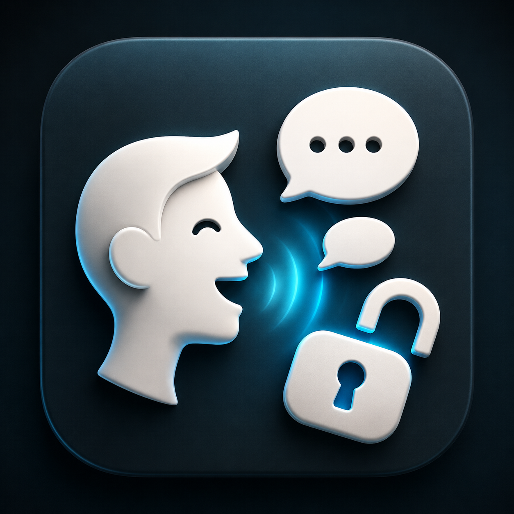
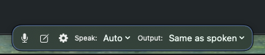
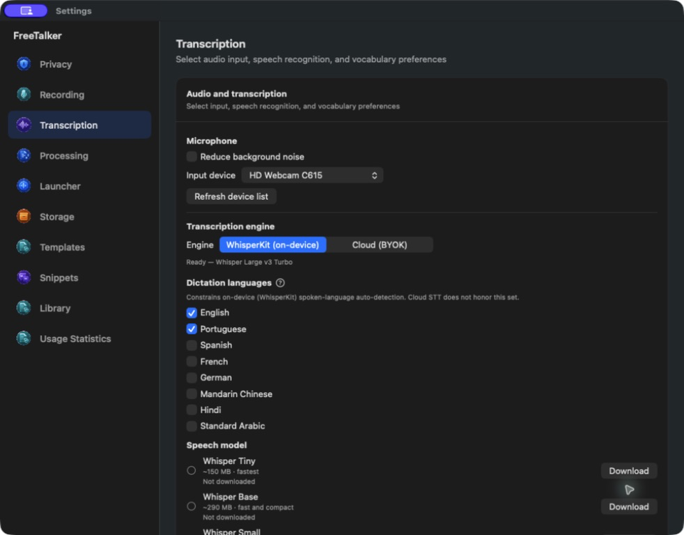
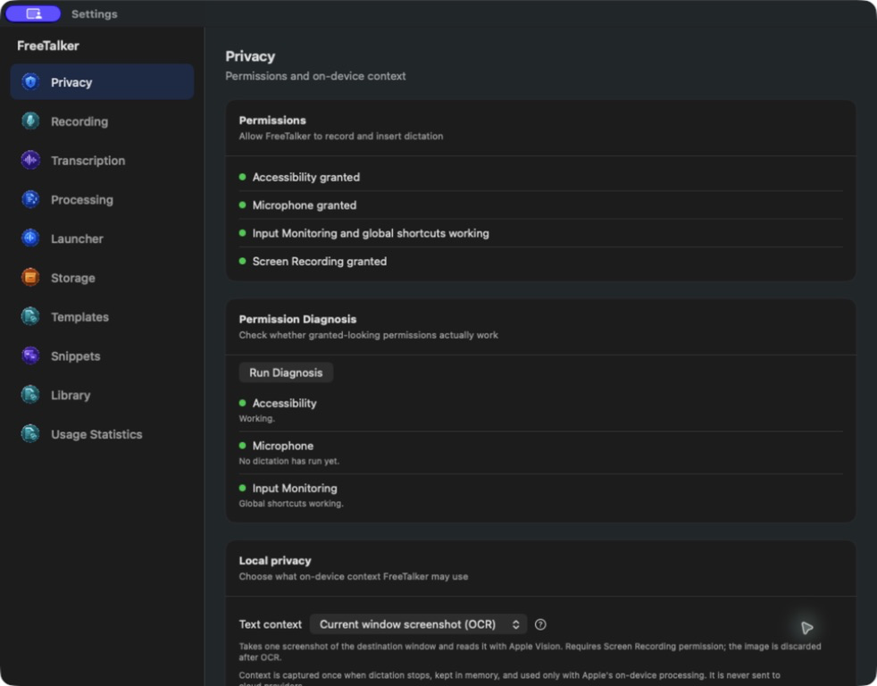
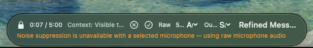
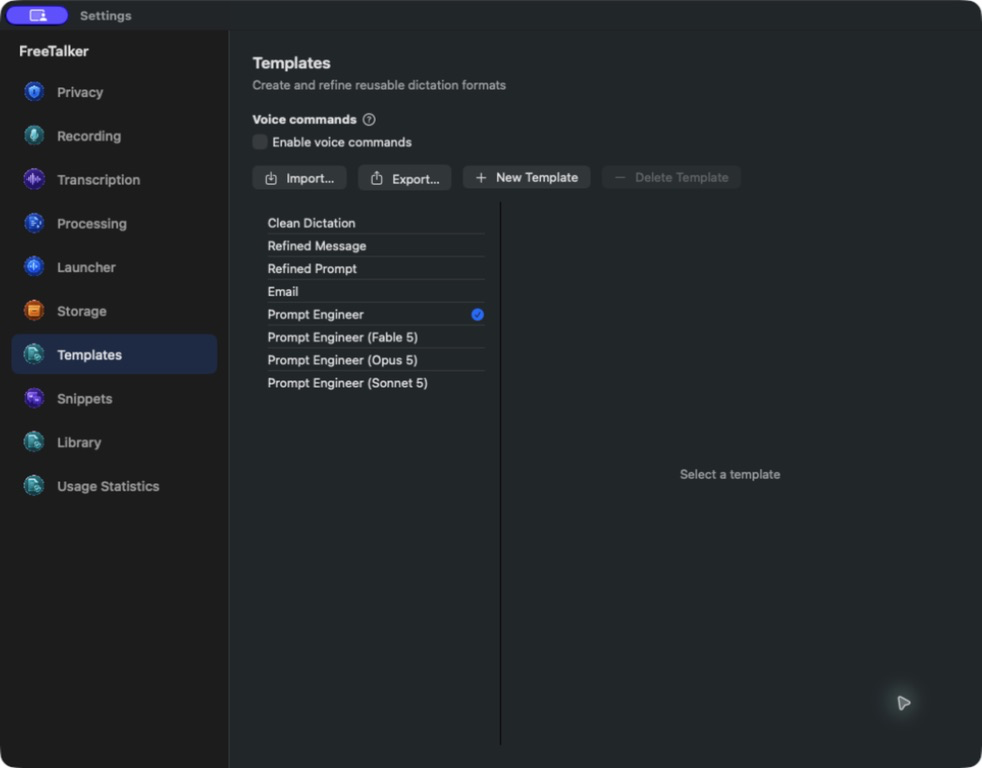
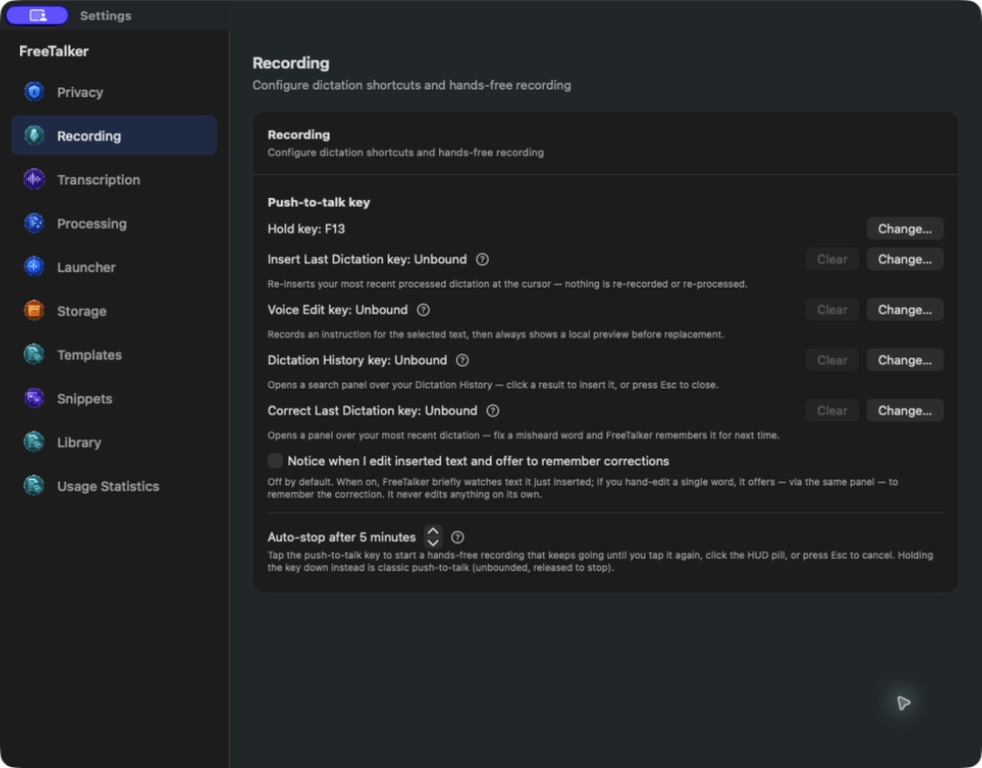

<p align="center"></p>

# FreeTalker

System-wide push-to-talk dictation for macOS. Hold a hotkey (default **Right-⌥**), speak,
release — the transcript is refined by the Active Template and inserted at your cursor. Tap
the same key instead of holding it for hands-free recording. Local Whisper transcription and
on-device Apple post-processing by default; cloud engines are optional and BYOK-only.

<p align="center">
  
</p>

## Requirements

- macOS 26, Apple Silicon.
- Xcode Command Line Tools (Swift 6.3+) are sufficient to build and run the app; the app is
  a Swift Package, not an `.xcodeproj`.
- Contributors running the test suite need full Xcode installed at
  `/Applications/Xcode.app` by default so Swift Testing is available.

## Build

```sh
make app     # swift build -c release, then assembles FreeTalker.app
open FreeTalker.app
```

Or in one step: `make run`.

The app build remains Command Line Tools-only and does not change the selected developer
directory. To run tests, use `make test`. The Makefile checks for full Xcode and Swift Testing,
prints the developer directory it uses, and scopes `DEVELOPER_DIR` to the test command without
mutating `xcode-select`. Override a non-default Xcode location explicitly:

```sh
make test XCODE_DEVELOPER_DIR=/path/to/Xcode.app/Contents/Developer
```

`make app` (via `make bundle`, see below) copies the release binary into
`FreeTalker.app/Contents/MacOS/`, writes `Contents/Info.plist` (from `Info.plist` at the repo
root — `LSUIElement=true` so it's menu-bar-only, plus the microphone usage string and the
version stamped from `git describe --tags`), and ad-hoc codesigns the bundle
(`codesign --force --deep -s -`).

First launch will download the WhisperKit `large-v3-turbo` model (~1 GB) — the menu bar
status line shows download progress, and the first-run walkthrough (see "Permissions
walkthrough" below) shows it too.

`make bundle` does everything `make app` does except the final install into `/Applications` —
use it for anything that needs a signed, versioned bundle without disturbing an already-running
installed copy (this is what `scripts/release.sh` uses).

### Stable signing identity (strongly recommended)

Ad-hoc signing (`-s -`) gives every build a different signature, so macOS treats each
rebuild as a new app and can drop TCC grants (Accessibility, Input Monitoring, Microphone)
that were previously approved — see "Permissions walkthrough" below. This is purely a TCC-grant
concern now: self-update verification (see "Updating" below) uses a separate Ed25519 signature
that doesn't depend on this identity at all, so an ad-hoc build can still self-update fine — it
just loses its permission grants on every rebuild in the meantime. To make grants survive
rebuilds:

```sh
scripts/make-signing-cert.sh   # once: creates a self-signed "FreeTalker Dev" cert
```

Then, in Keychain Access, trust the cert for code signing (the script prints the exact
steps — macOS requires this GUI confirmation, it can't be scripted). Build with:

```sh
make app CODESIGN_IDENTITY="FreeTalker Dev"
```

To make plain `make app`/`make bundle` use the same identity by default, record it once at
the repo root: `echo "FreeTalker Dev" > .codesign-identity` (gitignored — the private key, and
this file pointing at it, never leave the machine that created them).

## Updating

The menu bar's "Check for Updates…" downloads the latest published release, verifies its
checksum (corruption check only), verifies its Ed25519 signature against the public key
compiled into the running app (the actual authenticity boundary — see
`Sources/FreeTalker/Update/UpdateSignatureVerifier.swift`), launches the downloaded build once
as a smoke test, and only then swaps it into place and restarts — see
`Sources/FreeTalker/Update/SelfUpdater.swift`. Any verification failure leaves the
currently-installed app untouched.

Unlike a codesign-identity pin (which only ever validates against a self-signed certificate's
own trust chain — something that fails closed on every machine except the one that manually
marked it "Always Trust" in Keychain Access), the Ed25519 public key has no keychain/trust-store
dependency at all, so this works identically regardless of how the app itself is codesigned.

## Release signing key (one-time, release-publisher only)

```sh
scripts/make-release-signing-key.sh   # once: generates the Ed25519 release-signing keypair
```

Writes the PRIVATE key outside this repo (default `~/.freetalker/release-signing-key.pem`,
override with `$FREETALKER_RELEASE_SIGNING_KEY`) and the PUBLIC key into
`keys/release-public-key.base64` — a plain text file holding nothing but that one base64 value,
which gets committed. `Sources/FreeTalker/Update/UpdatePublicKey.swift` (compiled into every
build) is **generated automatically from that file on every `swift build`/`swift test`** by the
`GenerateUpdatePublicKey` SwiftPM build tool plugin (`Plugins/GenerateUpdatePublicKey`) — it is
gitignored and never hand-edited; if you ever need to change the key, edit
`keys/release-public-key.base64` (normally only `scripts/make-release-signing-key.sh` does this)
and rebuild. Back the private key up somewhere safe immediately — if it's lost, no future
release can ever be verified by an app already built with the current public key; there's no
recovery path short of shipping a new build with a new public key and telling every existing
install to manually trust it again.

## Releasing

```sh
scripts/release.sh vMAJOR.MINOR.PATCH          # tag, build, sign (codesign + Ed25519), zip, checksum, publish
scripts/release.sh vMAJOR.MINOR.PATCH --dry-run # everything except tag/push/publish
```

Requires `.codesign-identity` to name a real (non ad-hoc) identity, the release-signing key
from `scripts/make-release-signing-key.sh` above, and `gh` (GitHub CLI) to be authenticated.
Every release is signed twice: with the local `FreeTalker Dev` certificate (TCC-grant
stability only, not a trust boundary — see "Stable signing identity" above) and with the
Ed25519 release-signing key (the actual update-authenticity boundary) — there's no CI and no
Apple Developer account involved (see `.claude/sdd/features/BRAINSTORM_INSTALL_AND_UPDATES.md`
for why). macOS will still block first launch of a downloaded build with "Apple could not
verify..." — that's expected for a non-notarized app; the person installing it right-clicks (or
Control-clicks) the app and chooses "Open" once. This is a one-time step per machine, not per
update.

## Speech models

Settings → Transcription offers seven multilingual Whisper models, from Tiny
and Base through Small, Medium, Large v3, and two Large v3 Turbo variants.
Smaller
models download faster, use less disk space, and usually transcribe faster.
Larger models favor accuracy, while the Turbo variants balance speed and
accuracy.

Download a model on demand, then select it to reload the transcription engine. You can
also delete downloaded models that aren't active. FreeTalker keeps the active model so a
cleanup can't remove the model currently serving dictation. WhisperKit shares model files
under `~/Documents/huggingface`.

<p align="center">
   Transcription showing the mic picker, noise reduction, WhisperKit vs Cloud engine toggle, model list, live preview, and vocabulary" width="700">
</p>

## Permissions walkthrough

A "Welcome" window opens automatically the first time FreeTalker launches, showing the same
three permissions below with live status plus the speech model download's progress, so you're
never left holding a hotkey that silently does nothing because something isn't granted yet. It
only appears once; permission status stays visible afterward in Settings → Privacy.

On first launch, grant (System Settings → Privacy & Security):

1. **Microphone** — prompted automatically the first time you hold the push-to-talk key.
2. **Accessibility** — required for the global push-to-talk key listener and for pasting the
   refined text at your cursor. The menu bar shows a warning with an "Open System Settings"
   button if this isn't granted; find FreeTalker in Privacy & Security → Accessibility and
   enable it, then relaunch.
3. **Input Monitoring** — macOS will prompt for this automatically the first
   time the app creates its global key listener (a consequence of Accessibility
   + CGEventTap). Settings considers Input Monitoring available when the global
   shortcut listener is operational, because that confirms FreeTalker can
   receive the shortcuts it needs.

Settings (menu bar → "Settings…") shows live permission status.

Local builds use ad-hoc signing, so rebuilding the app can invalidate
permissions that macOS previously granted. Relaunch the current
`FreeTalker.app` first. If a permission still appears unavailable, remove
FreeTalker from the relevant Privacy & Security list, add the current app
bundle again, enable it, and relaunch.

<p align="center">
   Privacy showing granted permissions and the local-only text context picker" width="700">
</p>

## Settings

Settings (menu bar → **Settings…**) uses a sidebar with ten focused
destinations. The **Processing** destination opens the **Context & Processing**
page.

<p align="center">
  
</p>

- **Privacy** — Check **Accessibility**, **Microphone**, **Input Monitoring**,
  and **Screen Recording** status, then run **Run Diagnosis** when a permission
  appears granted but does not work. Choose **Text context** to control what
  FreeTalker may read when dictation stops. That context stays on this Mac, is
  kept in memory, and is used only with Apple's on-device processing; FreeTalker
  never sends it to cloud providers. Turn on **Allow automation (Shortcuts,
  AppleScript)** to let other apps on this Mac clean up text with your Templates.
  Automation is off by default.
- **Recording** — Change the **Push-to-talk key** and bind separate keys for
  **Insert Last Dictation**, **Voice Edit**, **Dictation History**, and **Correct
  Last Dictation**. Turn on the correction watcher to offer to remember a
  single-word edit, and set the hands-free **Auto-stop** limit from 1 to 60
  minutes.
- **Transcription** — Choose the microphone and **Reduce background noise**,
  then select **WhisperKit (on-device)** or **Cloud (BYOK)**. Download, select,
  and delete speech models; choose dictation languages; enable **Live preview
  while recording**; and manage vocabulary and vocabulary suggestions. With
  **Type as you speak (Streaming ASR)** enabled, download and manage its
  separate streaming model. Cloud STT exposes **Provider**, **Model**, **Base
  URL**, **API key**, and **Test connection** controls.
- **Processing** — On the **Context & Processing** page, enable **Automatically
  choose template**, add **App Rules** that select a Template or transcript
  language for a specific app, and choose the **Default output language**.
  Configure optional **Cloud processing** with your provider and, where
  required, your own API key (BYOK). Translation requires Cloud post-processing;
  **Same as spoken** does not.
- **Launcher** — Turn on the **Show edge launcher** and choose its **Screen
  edge**, **Position along edge**, and pinned **Dictation language**. The
  **Notchpad** controls whether FreeTalker shows its HUD in the built-in
  MacBook notch when available.
- **Storage** — Set retention for failed dictation audio and imported
  transcripts. Recovery audio, imported media, derived audio, transcripts, and
  speaker data stay on this Mac, and FreeTalker never changes or deletes the
  original imported source. **Back Up…** saves settings, Templates, and Snippets
  to JSON; **Restore…** overwrites current settings and merges Templates and
  Snippets. API keys stay in the macOS Keychain and are excluded from JSON
  backups.
- **Templates** — Enable **Voice commands**, set their comma-separated keywords,
  and use **Import…**, **Export…**, **New Template**, and **Delete Template** to
  manage reusable dictation formats. Select a Template to edit its name and
  prompt, or make it the **Active Template**.
- **Snippets** — Create, edit, and delete Voice Edit shortcuts. Give each
  Snippet a name, add one trigger phrase per line, and enter its expansion. When
  a trigger matches, FreeTalker replaces the selected text with the expansion
  verbatim; other Voice Edit instructions use the normal AI edit.
- **Library** — Switch among **Dictations**, **Recoveries**, and **Imports**.
  Search past dictations, copy or translate the selected text, re-process it
  with another Template, or delete entries. **Delete All** also removes saved
  debug audio. Use **Recoveries** for failed dictation audio and **Imports** for
  imported media and transcripts.
- **Usage Statistics** — Review total dictations, total words, active days, and
  estimated time saved; inspect dictations per day for the last 30 days; and
  compare counts by language, Template, engine, and app. These statistics come
  from Dictation History, so deleting a dictation removes it from the
  statistics.

Each destination uses a generated transparent PNG icon. Settings that need
more context include a question-mark button that opens a short native
explanation; the same explanation is available as a hover tip.

## Running the app

<p align="center">
  
</p>

- Menu bar icon → pick the **Active Template** (Clean Dictation, Refined Message, Refined
  Prompt, Email — editable in Settings → Templates).
- Hold **Right-⌥**, speak (English or Portuguese, auto-detected), release. A small pill HUD
  shows "Recording…" then "Processing…". Turn on **Live preview while recording** in
  Settings → Transcription and the HUD streams the transcript as you speak,
  before refinement.
- **Reduce background noise** uses macOS voice processing with the
  system-default microphone. Choosing a specific input device uses verified raw
  capture instead; the HUD reports that noise suppression is unavailable. If
  voice-processed capture with the system default fails, FreeTalker retries once
  with raw microphone audio.
- Tap the key instead (under 0.4s) to start **hands-free recording**: it keeps going until you
  tap the key again, click the HUD pill, or press Esc to cancel. Holding the key down is still
  classic push-to-talk. An auto-stop cap (default 5 minutes, configurable 1–60
  in Settings → Recording) guards against a stuck key.
- The refined text is pasted at your cursor, and the HUD says "Pasted" when it lands — so a
  finished dictation is never just the pill disappearing.
- If pasting isn't possible the text is left on the pasteboard and the HUD says why, so you know
  what to fix rather than only that something went wrong: "Focus changed — copied, paste
  manually", "No text field focused — copied, paste manually", "Copied — grant Accessibility to
  paste automatically", or "Paste failed — copied, paste manually". Those notices stay up
  10 seconds rather than the usual 2.5, since they're the ones you have to act on.
- Skipped pastes are logged (reason and bundle ids, never the text) under the `insertion`
  category — `log stream --predicate 'subsystem == "org.freetalker.app"'`.
- Settings → Transcription can also **play a sound when a dictation finishes** (off by default),
  with different sounds for "landed in the app" and "left on the clipboard" — useful when you
  look away during a long dictation.
- **Library…** opens the searchable history of past Dictations, with "Re-process with…" to
  re-run a stored transcript through a different Template. Each entry can be deleted
  individually, or wiped entirely with **Delete All** — which also purges any saved debug audio
  (`last-dictation.wav`, failed-transcription recordings) alongside the database rows. Choosing
  **Translate…** sends the chosen Library text only to the configured Cloud post-processing
  endpoint.
- **Library → Recoveries** keeps failed dictation audio locally on this Mac so
  you can listen, retry with optional language/model/template overrides, or
  permanently delete it. Recovery audio is never uploaded by the recovery
  library itself. Settings → Storage controls automatic deletion after 1, 7
  (default), 30, or 90 days, or keeps it until you delete it.
- **Library → Imports** accepts WAV, M4A, MP3, MP4, and MOV from the file picker or drag and drop. FreeTalker extracts video audio, transcribes it with the selected local Whisper model, separates speakers locally, and lets you rename speakers and export TXT, Markdown, SRT, or VTT. Imports default to 7-day retention (configurable in Settings). The source file is never modified or deleted, and imported media, derived audio, transcripts, and speaker data never leave your Mac.
  The media integration suite generates a tiny MOV containing both video and audio, then verifies the production probe and decoder extract normalized 16 kHz mono frames without changing the MOV.
- An optional **Insert Last Dictation key** (Settings → Recording, unbound by
  default) re-inserts the newest Library entry at your cursor without
  re-recording or re-processing — handy when a paste got dismissed or
  overwritten.

## Type as you speak (Streaming ASR)

Turn on **Type as you speak (Streaming ASR)** in Settings → Transcription and confirmed words
appear directly in the focused field while you're still talking, instead of waiting for
"Processing…" to finish. When you release the key (or stop hands-free recording), that live-typed
text is replaced by the same refined output the Active Template would otherwise paste. It's off
by default, and distinct from **Live preview while recording** above — that preview only updates
the HUD pill and never touches the field you're dictating into.

Turning it on reveals a separate model to download: **Parakeet EOU 120M (160ms)**, downloaded and
deleted from Settings → Transcription the same way as the WhisperKit models above, but it's a
different model dedicated to streaming — the WhisperKit models don't do this.

Streaming only engages for English today — that's the full extent of what the underlying
streaming model supports right now. It also requires the spoken language for that Recording to
be explicitly resolved (English, via the language pin or an App Rule) at the moment you start
recording; leaving language on **Auto** never streams, since there's no known language to type in
yet. Cloud STT, Scratchpad dictation, and secure fields (password inputs) don't stream either —
all of these fall back silently to today's batch behavior: no partial typing, refined text pasted
once you stop, unchanged from before this feature existed. Tapping a one-shot **EN**/**PT**
language override on the Recording Panel mid-recording also falls back to batch for the rest of
that Recording, rather than trying to restart streaming under the new language.

Safety comes first. Streaming only starts when the focused field has an empty, collapsed cursor —
never over a selection, since typing over one would silently destroy it with no way to restore it
on Cancel. Before removing anything it typed, FreeTalker re-reads the field and confirms its
typed text is still exactly where it left it. If the frontmost window changes, the field turns
secure, or anything doesn't match, FreeTalker leaves your typed text on screen untouched and puts
the refined text on the clipboard instead of pasting it.

If FreeTalker quits or crashes while live-typed text is still on screen, that text stays in your
document. It is never cleaned up automatically after a relaunch — deliberately: reconciling a
possibly-stale record of what was typed against a document you may have kept editing since is
more dangerous than leaving the correct-at-the-time partial text alone.

For a long dictation — past roughly 400 typed characters — FreeTalker skips the replace step
entirely: the typed text stays on screen as-is, and the refined version goes to the clipboard
instead of being pasted over it.

## Floating controls and scratchpad

The edge launcher is off by default. In Settings → Launcher, turn on **Show
edge launcher**, choose its screen edge, and select **Auto**, **English**, or
**Portuguese** as the default dictation language. Hover over the launcher to
reveal dictation, Scratchpad, Settings, and language controls.

Drag the collapsed launcher, recording HUD, or temporary status HUD anywhere
within the usable area. FreeTalker remembers each surface independently for
each display. A visible Dock and menu bar remain unobstructed. When the Dock is
auto-hidden, or another app is full-screen on that display, you can move the
surface to the physical bottom edge. Moving between Spaces or displays
reclamps each surface without making it an active window.

Set **Default output language** in Settings → Processing to **Same as spoken**
(the default), English, Portuguese, Mandarin Chinese, Hindi, Spanish,
Standard Arabic, French, or German. The edge launcher and recording HUD can
override that choice for one recording without changing the default. Named
output languages are API-only: FreeTalker sends the live transcript to the
configured Cloud post-processing endpoint. A requested translation never
falls back to Apple's on-device model, another provider, or automatic
source-text insertion.

Open **Scratchpad…** from the menu bar or the edge launcher. Type directly, or
place the insertion point or select text and choose **Dictate**; live speech
appears as a preview before the final transcript is inserted. Use the toolbar
for body and heading styles, bold, italic, bulleted and numbered lists, or
clearing supported formatting. Scratchpad text and formatting are saved
automatically on this Mac.

Scratchpad AI actions require a configured API-backed Cloud post-processing
provider under Settings → Processing. **Improve writing**, **Expand**,
**Condense**, and **Custom instruction** send the selected text to that
configured cloud endpoint, or send the entire Scratchpad when nothing is
selected. These actions don't fall back to Apple's on-device model. If the
source changes while a request is running, FreeTalker leaves it untouched
instead of replacing newer edits.

## Templates

Four built-ins ship with the app: **Clean Dictation** (default), **Refined Message**,
**Refined Prompt**, and **Email**. Every Template strips disfluencies ("um", "uh", "hmm") and
collapses self-corrections — "I'll do A… actually, I'll do B" becomes "I'll do B" — even when
the correction spans multiple sentences.

A built-in Template you've never edited quietly picks up improved prompts as the app evolves;
once you edit one yourself, it's yours and is never touched automatically.

<p align="center">
   Templates showing the template list and the Refined Message prompt editor" width="700">
</p>

### Spoken Commands

Every built-in Template also interprets a set of English instruction phrases spoken mid-dictation,
regardless of what language the rest of the dictation is in — say "scratch that" partway through a
Portuguese dictation and it's still interpreted as a command, not transcribed. Supported phrases:
"new paragraph", "new line", "quote" … "unquote", "bullet point", "numbered list", "all caps" …
"end caps", and "scratch that" (removes the sentence or clause you said immediately before it). A
phrase used descriptively rather than as an instruction — "I added a new paragraph about
pricing" — is still transcribed literally; when in doubt, the model transcribes rather than acts.

### Context awareness

Settings → Processing → **App Rules** maps an app (by bundle ID)
to a Template and/or a forced Transcript language, so dictating in Slack can
default to Refined Message while Mail defaults to Email. A rule can set either
half alone or both together. The Active Template is still used when no rule's
Template half matches; see "Language" below for how the language half fits
with the pin and the Recording Panel. The frontmost app's identity is also
passed to the post-processor as context, so refined output can account for
where it's headed.

Settings → Privacy → **Local context** can optionally capture selected text,
the focused field, the active window's accessibility text, or a one-time
active-window screenshot read by Apple Vision OCR. The scope defaults to Off
and is captured exactly once when dictation stops. Manual App Rules always
take precedence over the optional automatic local style.

Selected text, Focused field, and Active window require Accessibility permission. Window + local
OCR requires Screen Recording permission only; Accessibility can improve its window metadata but
is not required for capture or OCR. If the exact stopped window is no longer available, FreeTalker
continues without OCR instead of capturing another window.

macOS exposes Screen Recording preflight as granted or not granted. Settings
reflects that current state directly and offers explicit **Request Access** and
**Open System Settings** actions when it is not granted. After you grant access,
macOS may require FreeTalker to relaunch before preflight reports it as
available. If it remains unavailable, remove and re-add the current app bundle
in Privacy & Security, then relaunch it.

**Local-only privacy boundary:** accessibility text, screenshots, and OCR output stay in memory
and are supplied only to Apple's on-device Foundation Model. Screenshot bytes are released
immediately after local OCR. Local context is never persisted, logged, or included in cloud/BYOK
post-processing requests; when cloud post-processing is configured, FreeTalker omits it entirely.

### Voice Edit and snippets

<p align="center">
   Recording showing the push-to-talk hold key, Insert Last Dictation key, Voice Edit key, and hands-free auto-stop cap" width="700">
</p>

Assign a **Voice Edit key** in Settings → Recording, select editable text, and
press the key. Speak the instruction, then press the key again. Voice Edit
transcribes the instruction with the local WhisperKit engine, resolves any
exact snippet trigger from the on-device snippet database, and uses Apple's
on-device Foundation Model when generation is needed. It always shows a
preview of the original and proposed text; nothing is replaced until you
explicitly confirm. If the app, field, selection, or selected text changed,
replacement is refused and Copy remains available. If the focused field is
editable but nothing is selected, Voice Edit targets your last dictation
instead of asking you to select text first — see "Correction Loop" below.

Create, edit, rename, or delete reusable snippets under Settings → Snippets. Put one trigger phrase
per line. Matching ignores case, surrounding punctuation, and repeated whitespace, while duplicate
normalized triggers are rejected. Ambiguous snippets migrated from older versions require an
explicit choice in the preview and can be resolved by editing their trigger phrases in Settings.
Snippet renames update the persisted record used by future matches.

Voice Edit selected text, spoken instructions, and previews stay in memory and
are never sent to a cloud service, saved to Library, or logged. Snippet names,
triggers, and expansions are stored only in FreeTalker's local SQLite database.

### Custom vocabulary

Settings → Transcription → **Vocabulary** takes a list of names, jargon,
or acronyms your dictation tends to get wrong. Terms bias WhisperKit's decoding
toward the right spelling and are also enforced as corrections during
post-processing, so they hold even if the transcript missed them.

See "Correction Loop" below for a faster way to fix a single misheard word
right after it happens.

### Correction Loop

FreeTalker sometimes mishears a name or a piece of jargon. Before Correction
Loop, fixing that meant retyping it by hand, and the app never learned from
the fix — it kept mishearing the same word. Correction Loop gives you three
ways to fix a word in the moment and have FreeTalker remember it, feeding the
same vocabulary Custom vocabulary (above) already backs.

Assign a **Correct Last Dictation key** in Settings → Recording (unbound by
default, same as Insert Last Dictation) and press it to open a small panel
over your most recent dictation. It shows what FreeTalker heard and an
editable field pre-filled with the same text — fix the word in place and
press **Fix It** (or Return). **Cancel** or Esc closes without changing
anything.

You can also just speak the fix. Press the **Voice Edit key** with nothing
selected — Voice Edit now falls back to targeting your most recent dictation
instead of asking you to select text first — then work through it exactly as
described in "Voice Edit and snippets" above: speak the correction, press the
key again, and confirm the preview.

A third, opt-in path: turn on **"Notice when I edit inserted text and offer
to remember corrections"** in Settings → Recording — off by default. When
it's on, FreeTalker briefly watches the text it just inserted; if you
hand-edit a single word, it opens the same panel, pre-filled with your edit,
so you only have to confirm. It never changes anything on its own.

Whichever path you use, a correction you make deliberately takes effect
immediately — active right away — unlike a mined suggestion (Settings →
Transcription → Vocabulary), which waits in the suggestions list until it's
recurred enough to be worth asking about. If you'd already dismissed a
suggestion for that exact term, correcting it again doesn't quietly reinstate
it — the panel asks you to confirm ("Approve anyway") first.

If your vocabulary is already at its budget, Correction Loop doesn't evict
anything silently to make room: it names the specific term it would drop and
asks first ("Drop 'X' to learn 'Y'?"). Confirming swaps exactly the term you
were shown; if that term stopped being applicable by the time you confirm
(say, it was dismissed from Settings while the panel was open), you get a
fresh offer instead of a stale swap going through. If there's nothing left to
offer swapping — your own vocabulary list alone already fills the budget — it
says so and the new term simply isn't learned, again never a silent eviction.

Limitations, plainly:

- FreeTalker only remembers where it inserted text for about ten minutes.
  Past that, confirming a correction still teaches it the right word for next
  time, but it can no longer reach back into your document to fix the word in
  place.
- All three paths correct your most recent dictation only, never an older
  Library entry.
- Text dictated into the Scratchpad isn't tracked, so none of the three paths
  can find it.
- A dictation you reprocessed with a different Template isn't tracked either.
- A spoken correction refuses rather than guesses when it can't prove it's
  looking at the right document — in a browser, two tabs can share the same
  URL, which FreeTalker can't tell apart, so it may decline there rather than
  risk editing the wrong tab.
- The edit watcher only ever reads the exact range FreeTalker itself
  inserted, allows that text to grow or shrink by up to 32 characters, and
  stops watching that insertion — rather than reading further — the moment
  you keep typing past what it can safely account for.

## Language

The menu bar has an **Auto / English / Portuguese** pin below the Template list,
forcing the transcript language instead of auto-detecting it. Settings →
Processing → **App Rules** can override the pin per app, alongside
its Template rule. The Recording Panel's EN/PT buttons (below) add a one-shot
override on top of both, good for a single dictation without changing any
standing setting. Precedence, most to least specific: **one-shot > app rule >
pin > auto**.

## Recording Panel

While recording (both push-to-talk hold and hands-free), the HUD shows a row of controls instead
of a plain pill:

- **Cancel** (✕) discards the recording.
- **Done** (✓) stops and runs it through the Active Template, same as releasing the key.
- **Raw** stops and pastes the transcript verbatim, skipping post-processing entirely; the
  Library entry is filed under the reserved Template name "Raw Transcript" rather than whatever
  Template was active.
- **EN** / **PT** set a one-shot language override for this recording only (tap the active one
  again to clear it) — see "Language" above for how it fits with the pin and App Rules.
- The Template name button cycles the Active Template without leaving the recording.
- **Lock** (only shown while not already locked) switches a held push-to-talk key into
  hands-free recording without releasing it — the elapsed/cap readout replaces the Lock button
  once locked.

## Cloud engines (BYOK)

Both the transcription and post-processing stages default to on-device models and can
optionally be pointed at a cloud provider — bring your own API key, nothing is bundled. Keys
live in the macOS Keychain only; they're never written to disk unencrypted, bundled with the
app, or logged.

- **Cloud STT** — Settings → Transcription → **Transcription engine**
  toggles between WhisperKit (on-device, default) and Cloud. The provider must serve the
  OpenAI-compatible `/audio/transcriptions` endpoint (e.g. OpenAI `whisper-1`). Ollama — cloud
  or local — does not support transcription; use it for Cloud post-processing only.
- **Cloud post-processing** — Settings → Processing → **Cloud
  post-processing** accepts a provider, base URL, and model. Supported
  providers are OpenAI-compatible endpoints
  (including [Ollama cloud](https://ollama.com/v1)) and Anthropic. Once a provider has a key,
  endpoint, and model all set, cloud post-processing runs automatically for every Dictation —
  it isn't chosen per Template. A key is optional only for an OpenAI-compatible loopback HTTP
  endpoint (`localhost`, `127.0.0.1`, or `::1`); other endpoints and providers still require
  one. For ordinary template formatting that doesn't request translation,
  leaving a required field unset can fall back to the on-device Apple model.
  Named output translation, Scratchpad AI actions, and Library translation are
  API-only and never use that fallback.

Both sections have a **Test connection** button, enabled once the required fields are filled
in. It sends a single request and reports a fixed status hint — "Connected ✓", an HTTP failure
like "Failed — HTTP 401 (check API key)", or "Failed — cannot reach host" — never the raw
response body or the key itself. For Cloud STT this only verifies reachability and credentials
via `GET /models`; it cannot confirm the provider actually supports transcription.

For fully local LLM post-processing, run Ollama Desktop and use the existing
OpenAI-compatible BYOK provider with `http://localhost:11434/v1`. Ollama's local endpoint
doesn't require an API key; FreeTalker omits the Authorization header when the key is empty.
This local endpoint applies to Cloud processing (LLM) only, not Cloud STT.

## Automation (Shortcuts, AppleScript)

Other apps on the Mac — Shortcuts, `osascript`, Raycast, Alfred, Keyboard Maestro — can ask
FreeTalker to **clean up a piece of text** with one of your own Templates. Nothing else is
exposed; there's no way to start a dictation, read your Library, transcribe a file, or touch
your settings from automation.

It's off by default. To turn it on: Settings → Privacy → **Automation**, toggle **"Allow
automation (Shortcuts, AppleScript)"**.

The exact command syntax lives in FreeTalker's own AppleScript dictionary — open it from Script
Editor via File → Open Dictionary → FreeTalker — and it's reproduced below verbatim from
`Assets/FreeTalker.sdef`.

### `clean up`

Runs any text you already have through one of your own Templates and returns the result.

| Parameter | AppleScript keyword | Type | Required | Default |
|---|---|---|---|---|
| direct parameter | *(none, positional)* | `text` | yes | — |
| `using template` | `using template` | `text` (exact Template name) | yes | — |

```sh
osascript <<'EOF'
tell application "FreeTalker"
    clean up "so basically what we need is uh three things by friday" using template "Email"
end tell
EOF
```

An unknown Template name is an error, never a silently-substituted default.

*(The example above has not been executed — the first automation call to FreeTalker triggers a
one-time macOS Automation consent dialog that only an interactive user, not a script, can
accept; see below.)*

### What the caller sees

- `clean up` **blocks until the result is ready** — like any other slow step in a Shortcut or
  AppleScript.
- Failures come back as AppleScript errors the caller can branch on, not silent empty results —
  for example: automation turned off, an unknown Template name, or another automation request
  already in flight (`busy`).
- **The first automation call triggers a one-time macOS Automation consent dialog** — macOS
  asking whether the calling app (Script Editor, Terminal, Shortcuts, …) may control FreeTalker.
  Someone has to be at the Mac to click Allow; this can't be granted unattended or from a
  headless/non-interactive session. Once granted, it's remembered for that calling app.

### `clean up` and on-device processing

`clean up` **always** runs on FreeTalker's on-device model — Apple's Foundation Models
framework — never a cloud provider, regardless of what's configured for interactive dictation.
That means no API key is ever read, no cloud endpoint is ever contacted, and no cloud tokens are
ever spent by this command. It also **never applies your learned/custom vocabulary** — text
handed to `clean up` from outside FreeTalker has no legitimate reason to see the words FreeTalker
has learned from your own dictations, so that list is never threaded into the prompt for this
path. A capability that has no on-device equivalent — output-language translation, for
instance — is simply unavailable through `clean up` and returns a distinct error rather than
silently falling back to a different result.

Once Automation is on, `clean up`'s `using template` parameter can invoke any of your Templates,
and the text you pass in shares a prompt with that Template's own instructions — treat every
enabled Template's prompt as readable by an automation caller.

### Limitations

- **The security boundary is the macOS Automation consent prompt — not a sandbox.** FreeTalker
  itself isn't sandboxed, honestly stated: a program already running as the same Mac user account
  as FreeTalker is not something Automation defends against — it only restricts what a
  well-behaved calling app can reach.

## Manual end-to-end checklist

1. `make run`. Confirm the menu bar waveform icon appears (no Dock icon — it's
   `LSUIElement`).
2. Open Settings → Privacy. Grant Accessibility if prompted; confirm the dot
   turns green.
3. Click into TextEdit (or any text field). Hold Right-⌥, say a short English sentence,
   release. Confirm: HUD pill appears then disappears, and the refined text is pasted at the
   cursor within a few seconds (first run: WhisperKit downloads the model first — watch the
   menu bar status line).
4. Repeat step 3 speaking Portuguese (pt-BR). Confirm the Library entry shows `language: pt`
   and the refined text reads naturally in Portuguese.
5. Open Library…. Confirm both Dictations appear, reverse-chronological, with transcript +
   refined output. Search for a distinctive word from step 3; confirm it's found.
6. Pick a Library entry → "Re-process with…" → a different Template. Confirm a new entry is
   appended and the newly refined text is pasted at the cursor.
7. Settings → Templates: edit a prompt, confirm it persists (re-open Settings). Add a new
   Template, make it Active from the menu bar, dictate, confirm it's used.
8. Settings → Recording → "Change…" next to the push-to-talk key, press a
   different modifier (for example, Left-⌃), confirm the label updates, and
   confirm that key now triggers recording instead of Right-⌥.
9. (Optional, BYOK) Set a Cloud STT key under Settings → Transcription, or
   fill in Cloud post-processing under Settings → Processing. Dictate and
   confirm the cloud path is used and the Library row's `engine` reflects it.
   Then unplug the network or clear the key and confirm post-processing failure
   falls back to the raw transcript being pasted without dropping the
   dictation.
